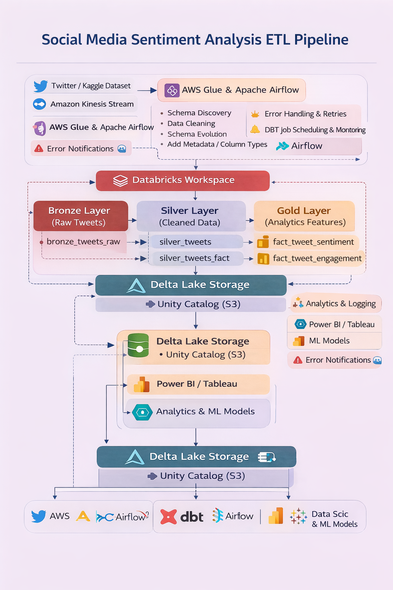
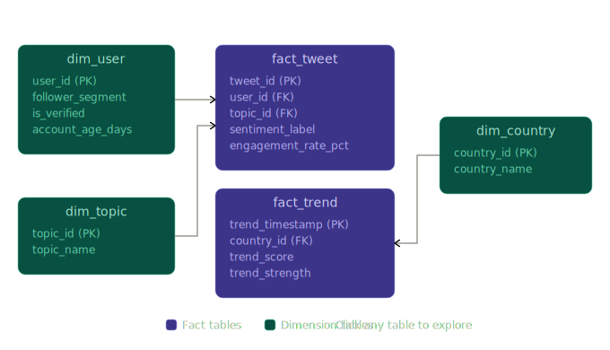
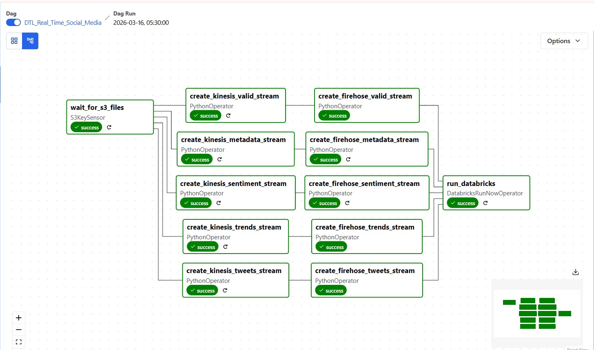
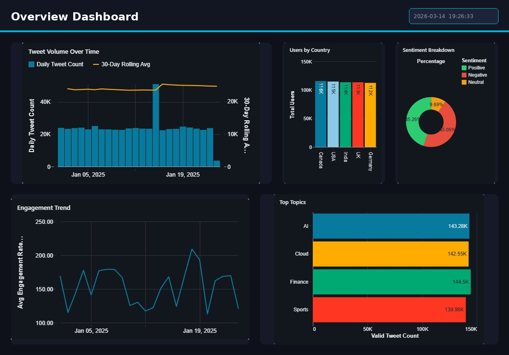
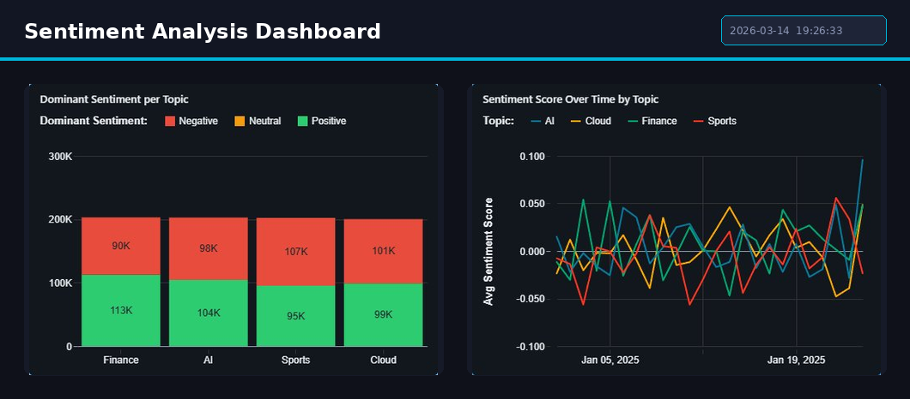
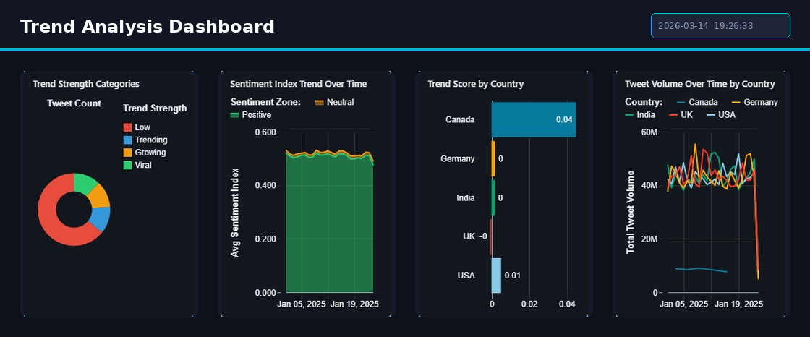

<div align="center">

# Real-Time Social Media Sentiment Analysis Pipeline

**End-to-End Lakehouse Analytics on AWS · Databricks · PySpark · Delta Lake · Apache Airflow · DBT**


---

*A production-grade, cloud-native data engineering pipeline that ingests ~50,500 social media records per source table, processes them through a three-tier Medallion Architecture (Bronze → Silver → Gold), and produces analytics-ready datasets powering real-time sentiment dashboards, user influence rankings, and geographic trend analysis.*

</div>

---

## Table of Contents

- [Architecture Overview](#architecture-overview)
- [System Design & Data Flow](#system-design--data-flow)
- [Medallion Architecture](#medallion-architecture)
  - [Bronze Layer — Raw Ingestion](#bronze-layer--raw-ingestion)
  - [Silver Layer — Cleansed & Conformed](#silver-layer--cleansed--conformed)
  - [Gold Layer — Business-Ready Analytics](#gold-layer--business-ready-analytics)
- [Data Modeling — Star Schema](#data-modeling--star-schema)
- [DBT Transformation Layer](#dbt-transformation-layer)
- [Pipeline Orchestration — Apache Airflow](#pipeline-orchestration--apache-airflow)
- [Data Quality & Testing Framework](#data-quality--testing-framework)
- [Monitoring & Alerting](#monitoring--alerting)
- [Analytics Dashboards](#analytics-dashboards)
- [Dataset Catalog](#dataset-catalog)
- [Technology Stack](#technology-stack)
- [Project Structure](#project-structure)
- [Getting Started](#getting-started)
- [Future Roadmap](#future-roadmap)
- [License](#license)

---

## Architecture Overview

This pipeline implements a **Lakehouse Architecture** on Databricks, combining the scalability of a data lake (AWS S3) with the transactional reliability of Delta Lake — orchestrated end-to-end via Apache Airflow and transformed through DBT.

### End-to-End Architecture Diagram



**Core Infrastructure Components:**

| Layer | Service | Role |
|---|---|---|
| **Ingestion** | AWS S3 (`eu-north-1`) | Object storage for raw Parquet files |
| **Cataloging** | AWS Glue Data Catalog | Schema registry & metadata management |
| **Processing** | Databricks (PySpark) | Distributed compute for ETL transformations |
| **Storage** | Delta Lake | ACID-compliant columnar storage with versioning |
| **Transformation** | DBT (Data Build Tool) | SQL-based modular transformation framework |
| **Orchestration** | Apache Airflow | DAG-based workflow scheduling & dependency management |
| **Governance** | Unity Catalog | Centralized access control & data lineage |
| **Visualization** | Databricks SQL Dashboards | Interactive BI dashboards |

---

## System Design & Data Flow

```
┌──────────────────────────────────────────────────────────────────────┐
│                         DATA FLOW PIPELINE                          │
├──────────────────────────────────────────────────────────────────────┤
│                                                                      │
│   ┌─────────┐     ┌─────────────┐     ┌───────────────────────┐     │
│   │  AWS S3  │────▶│  AWS Glue   │────▶│  Databricks Cluster   │     │
│   │ Parquet  │     │  Catalog    │     │   (PySpark Runtime)   │     │
│   └─────────┘     └─────────────┘     └───────────┬───────────┘     │
│                                                    │                 │
│                    ┌───────────────────────────────┘                 │
│                    ▼                                                 │
│   ┌────────────────────────────────────────────────────────────┐     │
│   │              MEDALLION ARCHITECTURE                        │     │
│   │                                                            │     │
│   │  ┌──────────┐    ┌──────────┐    ┌──────────────────┐     │     │
│   │  │  BRONZE  │───▶│  SILVER  │───▶│  GOLD (DBT)      │     │     │
│   │  │  ~50.5K  │    │  ~47K    │    │  Star Schema     │     │     │
│   │  │  rows/tbl│    │  rows/tbl│    │  Fact + Dim      │     │     │
│   │  └──────────┘    └──────────┘    └────────┬─────────┘     │     │
│   │                                           │               │     │
│   └───────────────────────────────────────────┼───────────────┘     │
│                                               ▼                     │
│                                   ┌───────────────────┐             │
│                                   │    Databricks SQL  │             │
│                                   │     Dashboards     │             │
│                                   └───────────────────┘             │
│                                                                      │
│   Orchestration: Apache Airflow  │  Governance: Unity Catalog       │
└──────────────────────────────────────────────────────────────────────┘
```

---

## Medallion Architecture

### Bronze Layer — Raw Ingestion

> **Objective:** Ingest raw data from S3 with full fidelity, preserving source schemas and enabling historical traceability.

**Ingestion Specifications:**

| Parameter | Value |
|---|---|
| Source Format | Apache Parquet |
| Source Location | `s3://realtime-parquetfiles/` (eu-north-1) |
| Catalog Registration | AWS Glue → `realtime_tweets` database |
| Write Format | Delta Lake (ACID-compliant) |
| Catalog Namespace | `social_catalog.bronze` |
| Record Volume | ~50,500 rows per source table |

**Operations Performed:**

- Direct Parquet read from S3 via `spark.read.parquet()` with Glue Catalog integration
- Schema-on-read validation against expected column contracts
- Injection of `ingested_at` audit timestamp via `current_timestamp()` for data lineage
- Persistence as managed Delta tables under Unity Catalog governance

**Bronze Tables:**

| Table | Schema Key Columns | Purpose |
|---|---|---|
| `sentiment_table` | `tweet_id`, `sentiment_score`, `positive_score`, `negative_score`, `neutral_score` | Raw sentiment metrics per tweet |
| `trends_table` | `trend_timestamp`, `topic_catagory`, `country`, `tweet_volume`, `trend_score` | Trending topic data by geography |
| `tweets_table` | `tweet_id`, `user_id`, `tweet_text`, `likes`, `retweets`, `replies`, `engagement` | Core tweet content & engagement |
| `user_metadata_table` | `user_id`, `country`, `followers_count`, `following_count`, `posts_count`, `varified` | User profile & account metadata |
| `valid_table` | `tweet_id`, `topic_category`, `tweet_text`, `sentiment_score`, `engagement_count` | Pre-validated tweet subset |

---

### Silver Layer — Cleansed & Conformed

> **Objective:** Apply deterministic cleaning rules, handle nulls, remove duplicates, and produce a conformed dataset ready for analytical modeling.

**Transformation Pipeline:**

```
Raw Bronze Data
    │
    ├── Timestamp Parsing ──────────── cast string → TimestampType
    ├── Null Imputation ────────────── numeric: mean substitution
    │                                  categorical: mode / "Unknown"
    ├── Column Standardization ─────── lowercase, trim, rename
    ├── Duplicate Elimination ──────── dropDuplicates(["tweet_id"]) / ["user_id"]
    ├── Data Enrichment ────────────── topic & country gap-filling
    └── Validation Filters ─────────── remove empty/null text rows
```

**Key Cleaning Rules:**

| Rule | Implementation | Scope |
|---|---|---|
| Null Numeric Fill | `fillna()` with column-level mean | `likes`, `retweets`, `replies`, `engagement`, `sentiment_score` |
| Timestamp Parsing | `to_timestamp()` with format inference | `timestamp`, `tweet_timestamp`, `trend_timestamp` |
| Text Sanitization | `trim()` + filter `lower(text) != "null"` | `tweet_text` |
| Duplicate Removal | `dropDuplicates()` on primary key | `tweet_id`, `user_id` |
| Topic/Country Fill | Forward-fill or "Unknown" substitution | `topic_category`, `country` |

**Output:** ~47,000 rows per Silver table (≈7% attrition from dedup + null filtering)

---

### Gold Layer — Business-Ready Analytics

> **Objective:** Model conformed data into a dimensional Star Schema optimized for BI consumption, with pre-computed aggregations and KPI metrics.

**Dimensional Model:**

| Table Type | Table Name | Grain | Key Columns |
|---|---|---|---|
| **Dimension** | `dim_topic` | One row per topic | `topic_id`, `topic_name` |
| **Dimension** | `dim_country` | One row per country | `country_id`, `country_name` |
| **Dimension** | `dim_user` | One row per user | `user_id`, `followers_count`, `verified`, `account_age_days` |
| **Fact** | `fact_tweet` | One row per tweet | `tweet_id`, `topic_id`, `user_id`, `sentiment_label`, `engagement_rate_pct` |
| **Fact** | `fact_trend` | One row per trend event | `trend_id`, `country_id`, `topic_id`, `trend_score`, `tweet_volume` |

**Computed Metrics:**

- `engagement_rate_pct` — `(engagement / impressions) * 100`
- `sentiment_label` — Categorical classification: `Positive` | `Negative` | `Neutral` (derived from `sentiment_score` thresholds)
- `account_age_days` — `datediff(current_date, account_created_date)`
- `influence_score` — Composite metric from `followers_count`, `engagement`, and `posts_count`

---

## Data Modeling — Star Schema

The Gold layer implements a **Star Schema** optimized for analytical query patterns with denormalized fact tables surrounded by conformed dimension tables.



**Design Rationale:**

- **Fact tables** store transactional grain events (tweets, trends) with foreign keys and pre-computed measures
- **Dimension tables** provide descriptive attributes for slicing (topic, country, user demographics)
- Schema is optimized for Databricks SQL query engine with Z-ordering on high-cardinality filter columns

---

## DBT Transformation Layer

DBT (Data Build Tool) manages all Gold layer transformations with a SQL-first, version-controlled approach.

**DBT Model Catalog:**

| Model | Type | Description |
|---|---|---|
| `fact_tweet_sentiment` | Fact | Joins tweets with sentiment scores; computes `sentiment_label` and `engagement_rate_pct` |
| `fact_tweet_engagement` | Fact | Aggregates engagement metrics by topic and time window |
| `dim_user` | Dimension | Deduplicates and enriches user metadata with computed fields |
| `dim_topic` | Dimension | Builds topic reference from distinct topic values |

**DBT Capabilities Leveraged:**

- **Modular SQL Models** — Incremental and view-based materializations
- **ref() Function** — DAG-based dependency resolution between models
- **Data Lineage** — Auto-generated lineage graphs via `dbt docs generate`
- **Schema Tests** — `unique`, `not_null`, `accepted_values`, `relationships` tests on every model
- **Version Control** — All models tracked in Git with CI-compatible structure

---

## Pipeline Orchestration — Apache Airflow

The end-to-end pipeline is orchestrated via an **Apache Airflow DAG** with task-level dependency management and configurable retry policies.



**DAG Configuration:**

```python
DAG_ID        = "socialmedia_pipeline_dag"
SCHEDULE      = "0 0 * * *"          # Daily at midnight UTC
START_DATE    = datetime(2025, 1, 1)
RETRIES       = 2
RETRY_DELAY   = timedelta(minutes=5)
CATCHUP       = False
```

**Task Dependency Graph:**

```
bronze_ingestion_task
        │
        ▼
silver_transformation_task
        │
        ▼
gold_aggregation_task (DBT models)
```

| Task | Operator | Description |
|---|---|---|
| `bronze_ingestion` | `DatabricksRunNowOperator` | Triggers Bronze notebook on Databricks cluster |
| `silver_transformation` | `DatabricksRunNowOperator` | Executes Silver cleaning logic |
| `gold_aggregation` | `DatabricksRunNowOperator` / `BashOperator (dbt run)` | Runs DBT models for Gold layer |

---

## Data Quality & Testing Framework

The pipeline implements a **multi-layered testing strategy** using `pytest` + PySpark, with test rigor increasing across Medallion layers.

### Test Coverage Matrix

| Test Category | Bronze | Silver | Gold | Description |
|---|:---:|:---:|:---:|---|
| Schema Existence | ✅ | ✅ | ✅ | Validates catalog schema (`bronze` / `silver` / `gold`) exists |
| Table Existence | ✅ | ✅ | ✅ | Asserts all expected tables are registered |
| Non-Empty Validation | ✅ | ✅ | ✅ | Ensures `count() > 0` for every table |
| Column Contract | ✅ | — | — | Validates expected columns exist per table |
| Column Naming Convention | ✅ | — | — | Asserts all column names are lowercase |
| `ingested_at` Not Null | ✅ | — | — | Audit timestamp integrity |
| Null Threshold (< 10%) | ✅ | — | — | Allowable null ratio on `tweet_id`, `tweet_text` |
| Strict Not Null | — | ✅ | — | Zero nulls on `tweet_id`, `user_id`, `timestamp` |
| Strict Deduplication | — | ✅ | — | Zero duplicate `tweet_id` and `user_id` records |
| Text Sanitization | — | ✅ | — | No empty or literal "null" text after cleaning |
| Numeric Completeness | — | ✅ | — | `likes`, `retweets`, `replies` fully populated |
| Sentiment Range | — | ✅ | — | `sentiment_score ∈ [-1, 1]` |
| Engagement Non-Negative | — | ✅ | — | `engagement >= 0` |
| Duplicate Ratio Monitoring | — | — | ✅ | Soft validation — logs `dim_user` duplicate ratio |
| Engagement Rate Bounds | — | — | ✅ | Soft validation — flags `engagement_rate_pct ∉ [0, 100]` |
| Sentiment Label Validity | — | — | ✅ | Soft validation — checks label ∈ {Positive, Negative, Neutral} |
| Foreign Key Integrity | — | — | ✅ | Soft validation — monitors null ratio on `topic_id`, `country_id` |

> **Testing Philosophy:** Bronze tests enforce **structural contracts** (schema, columns, audit fields). Silver tests enforce **data cleanliness guarantees** (zero nulls, zero duplicates, valid ranges). Gold tests use **soft validation** (monitoring + logging) to avoid pipeline failures on derived aggregation tolerances.

---

## Monitoring & Alerting

| Alert Type | Trigger | Channel |
|---|---|---|
| Task Failure | Airflow task fails after retry exhaustion | Airflow email callbacks |
| Data Quality Failure | Pytest assertion failure | Databricks job notifications |
| Pipeline Delay | DAG execution exceeds SLA threshold | Airflow SLA miss alerts |
| Volume Anomaly | Sudden drop/spike in tweet volume (> 2σ) | CloudWatch Alarms |
| Missing Source Data | S3 prefix returns zero objects | CloudWatch + SNS |

**Observability Stack:**

- **Airflow UI** — Task-level state tracking, Gantt charts, log inspection
- **Databricks Job Logs** — Spark stage metrics, executor diagnostics
- **AWS CloudWatch** — S3 access logs, Glue Crawler metrics, custom alarms
- **Unity Catalog Lineage** — Column-level lineage tracking across all layers

---

## Analytics Dashboards

Interactive dashboards built on **Databricks SQL** provide real-time visibility into social media engagement, sentiment distributions, and trend dynamics.

<table>
<tr>
<td width="50%">

### 📊 Overview


</td>
<td width="50%">

### 📝 Tweet Activity


</td>
</tr>
<tr>
<td width="50%">

### 🔍 Sentiment Analysis


</td>
<td width="50%">

### 📈 Trend Analysis


</td>
</tr>
<tr>
<td colspan="2" align="center">

### 👥 User Influence & Demographics


</td>
</tr>
</table>

**Dashboard Capabilities:**

- **Sentiment Trend Analysis** — Time-series visualization of Positive / Negative / Neutral sentiment proportions across topics
- **User Influence Rankings** — Top influencers ranked by composite engagement-weighted follower score
- **Topic Performance Matrix** — Cross-tabulation of engagement metrics (likes, retweets, replies) by topic category (AI, Sports, Finance, Cloud)
- **Geographic Trend Heatmap** — Country-level tweet volume and sentiment index distribution
- **Tweet Validity Distribution** — Valid vs. invalid tweet ratio monitoring
- **Temporal Activity Patterns** — Hourly and daily tweet activity heatmaps for peak detection

---

## Dataset Catalog

| Source Table | Records | Storage | Key Fields |
|---|---|---|---|
| `tweets_tb` | ~50,500 | Parquet → Delta | `tweet_id`, `user_id`, `tweet_text`, `likes`, `retweets`, `engagement` |
| `sentiment_tb` | ~50,500 | Parquet → Delta | `tweet_id`, `sentiment_score`, `positive_score`, `negative_score`, `neutral_score` |
| `trends_tb` | ~50,500 | Parquet → Delta | `trend_timestamp`, `topic_catagory`, `country`, `tweet_volume`, `trend_score` |
| `user_metadata_tb` | ~50,500 | Parquet → Delta | `user_id`, `country`, `followers_count`, `following_count`, `varified` |
| `valid_tb` | ~50,500 | Parquet → Delta | `tweet_id`, `topic_category`, `sentiment_score`, `engagement_count` |

**Data Origin:** AWS S3 bucket `realtime-parquetfiles` (Region: `eu-north-1`) → registered via AWS Glue Crawler into Glue Data Catalog database `realtime_tweets`.

---

## Technology Stack

| Category | Technology | Purpose |
|---|---|---|
| **Language** | Python 3.10+ | Core development language |
| **Distributed Processing** | Apache Spark / PySpark 3.x | Large-scale data transformation engine |
| **Lakehouse Platform** | Databricks | Unified analytics workspace |
| **Storage Format** | Delta Lake | ACID transactions, schema evolution, time travel |
| **Object Storage** | AWS S3 | Scalable raw data persistence |
| **Metadata Catalog** | AWS Glue Data Catalog | Centralized schema registry |
| **Transformation** | DBT (Data Build Tool) | SQL-based transformation framework |
| **Orchestration** | Apache Airflow 2.x | Workflow DAG scheduling & monitoring |
| **Data Governance** | Unity Catalog | Fine-grained access control & lineage |
| **Analytics** | Databricks SQL | Dashboard queries & BI visualizations |
| **Testing** | Pytest + PySpark | Automated data quality validation |
| **Version Control** | Git / GitHub | Source code & model versioning |

---

## Project Structure

```
Real-Time-Social-Media-Sentiment-Analysis-Pipeline/
│
├── Datasets/
│   ├── bronze_tweets_raw.csv            # Raw tweet content (~3.8 MB)
│   ├── bronze_sentiment_raw.csv         # Sentiment scores (~4.5 MB)
│   ├── bronze_trends_raw.csv            # Trending topics (~3.6 MB)
│   ├── bronze_user_metadata_raw.csv     # User metadata (~2.9 MB)
│   └── bronze_valid_tweets_raw.csv      # Validated tweets (~4.2 MB)
│
├── Development/
│   ├── bronze/
│   │   └── bronze_code.ipynb            # Bronze layer ingestion notebook
│   ├── silver/
│   │   └── silver_code.ipynb            # Silver layer transformation notebook
│   ├── gold/
│   │   └── gold_code.ipynb              # Gold layer modeling notebook
│   └── DAG/
│       └── dag_code.ipynb               # Airflow DAG definition notebook
│
├── Testing/
│   ├── test_bronze.py                   # 8 test cases — schema, columns, nulls, duplication
│   ├── test_silver.py                   # 10 test cases — strict nulls, dedup, range, text
│   └── test_gold.py                     # 7 test cases — schema, FK, soft validations
│
├── Dashboard/
│   ├── Social Media Analytics.lvdash.json  # Databricks dashboard config
│   ├── dashboard_queries.ipynb             # SQL queries for dashboard widgets
│   └── images/
│       ├── architecture.png
│       ├── airflow.jpeg
│       ├── data_model.svg
│       ├── overview_dashboard.png
│       ├── tweet_dashboard.png
│       ├── sentiment_dashboard.png
│       ├── trend_dashboard.png
│       └── users_influence_dashboard.png
│
└── README.md
```

---

## Getting Started

### Prerequisites

- **Databricks Workspace** with Unity Catalog enabled
- **AWS Account** with S3 and Glue permissions
- **Apache Airflow** instance (self-hosted or Managed Workflows for Apache Airflow)
- **Python 3.10+** with PySpark and DBT installed

### Installation

```bash
# Clone the repository
git clone https://github.com/Sahanap1708/real-time-sentiment-pipeline.git
cd real-time-sentiment-pipeline

# Install Python dependencies
pip install -r requirements.txt
```

### Running the Pipeline

**Option 1 — Databricks Jobs**

1. Import notebooks from `Development/` into Databricks Workspace
2. Create a Multi-Task Job with the following chain:
   ```
   bronze_code → silver_code → gold_code
   ```
3. Assign compute: `realtime-cluster` (recommended: `Standard_DS3_v2` or equivalent)
4. Set schedule: Daily @ `00:00 UTC`

**Option 2 — Airflow Trigger**

```bash
# Trigger the full pipeline DAG
airflow dags trigger socialmedia_pipeline_dag

# Monitor execution
airflow dags list-runs -d socialmedia_pipeline_dag
```

### Running Tests

```bash
# Execute all data quality tests (requires active Spark session on Databricks)
pytest Testing/ -v --tb=short
```

---

## Future Roadmap

| Enhancement | Description | Status |
|---|---|---|
| **Real-Time Streaming** | Integrate Apache Kafka / AWS Kinesis for sub-second ingestion | 🔜 Planned |
| **ML Sentiment Models** | Replace rule-based labeling with fine-tuned transformer models (BERT / DistilBERT) | 🔜 Planned |
| **Advanced BI** | Power BI / Tableau integration for enterprise-grade reporting | 📋 Backlog |
| **Automated DQ Monitoring** | Great Expectations integration for declarative data quality contracts | 📋 Backlog |
| **Multi-Platform Ingestion** | Extend to Reddit, LinkedIn, and Instagram via platform APIs | 📋 Backlog |
| **CI/CD Pipeline** | GitHub Actions for automated DBT model testing and deployment | 📋 Backlog |

---

## License

This project is developed for **educational and research purposes**.

---

<div align="center">

**Built with** ❤️ **using AWS · Databricks · PySpark · Delta Lake · Airflow · DBT**

</div>
